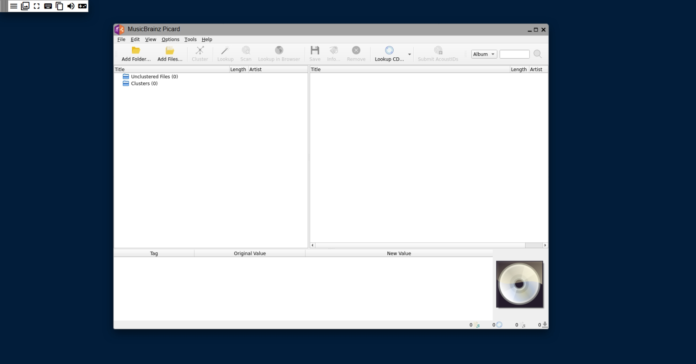
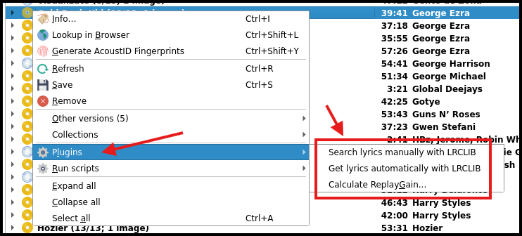

# Picard Web

<div align="center">
  
</div>

 
![GitHub Release](https://img.shields.io/github/v/release/aandree5/picard-web?logoColor=white&color=teal&label=Release&logo=data:image/svg+xml;base64,PCFET0NUWVBFIHN2ZyBQVUJMSUMgIi0vL1czQy8vRFREIFNWRyAxLjEvL0VOIiAiaHR0cDovL3d3dy53My5vcmcvR3JhcGhpY3MvU1ZHLzEuMS9EVEQvc3ZnMTEuZHRkIj4KDTwhLS0gVXBsb2FkZWQgdG86IFNWRyBSZXBvLCB3d3cuc3ZncmVwby5jb20sIFRyYW5zZm9ybWVkIGJ5OiBTVkcgUmVwbyBNaXhlciBUb29scyAtLT4KPHN2ZyB3aWR0aD0iNjRweCIgaGVpZ2h0PSI2NHB4IiB2aWV3Qm94PSIwIDAgNTEyLjAwIDUxMi4wMCIgdmVyc2lvbj0iMS4xIiB4bWxucz0iaHR0cDovL3d3dy53My5vcmcvMjAwMC9zdmciIHhtbG5zOnhsaW5rPSJodHRwOi8vd3d3LnczLm9yZy8xOTk5L3hsaW5rIiBmaWxsPSIjMDAwMDAwIj4KDTxnIGlkPSJTVkdSZXBvX2JnQ2FycmllciIgc3Ryb2tlLXdpZHRoPSIwIi8+Cg08ZyBpZD0iU1ZHUmVwb190cmFjZXJDYXJyaWVyIiBzdHJva2UtbGluZWNhcD0icm91bmQiIHN0cm9rZS1saW5lam9pbj0icm91bmQiLz4KDTxnIGlkPSJTVkdSZXBvX2ljb25DYXJyaWVyIj4gPHRpdGxlPnJvY2tldC1maWxsZWQ8L3RpdGxlPiA8ZyBpZD0iUGFnZS0xIiBzdHJva2U9Im5vbmUiIHN0cm9rZS13aWR0aD0iMSIgZmlsbD0ibm9uZSIgZmlsbC1ydWxlPSJldmVub2RkIj4gPGcgaWQ9Imljb24iIGZpbGw9IiNmZmZmZmYiIHRyYW5zZm9ybT0idHJhbnNsYXRlKDQyLjY2NjY2NywgNjQuMDAwMDAwKSI+IDxwYXRoIGQ9Ik00MDUuMzMzMzMzLDEuNDIxMDg1NDdlLTE0IEMzOTYuMzE2MzA1LDEyMi43OTQ4MDYgMzY0LjMxNjMwNSwyMTEuNjgzNjk1IDMwOS4zMzMzMzMsMjY2LjY2NjY2NyBDMjk5LjU4MjI2NSwyNzYuNDE3NzM1IDI4OC45MDU0NDYsMjg1LjMzMTg1IDI3Ny4zMDI4NzksMjkzLjQwOTAxMSBMMjc3LjMwMjQ2NCwzNDEuMjM0ODcyIEwyMTMuMzAyNDY0LDQwNS4yMzQ4NzIgTDE3NC4yNDgsMzM2Ljg5MSBMNjguNTI1LDIzMS4xNTcgTDcuMTA1NDI3MzZlLTE1LDE5MiBMNjQsMTI4IEwxMTIuMDc5NjEzLDEyOC4wMDA0MDQgQzEyMC4wODM4NTksMTE2LjM4NzI1OCAxMjguOTQ2MjEsMTA1LjcyMDQ1NyAxMzguNjY2NjY3LDk2IEMxOTMuNjQ5NjM4LDQxLjAxNzAyODYgMjgyLjUzODUyNyw5LjAxNzAyODU5IDQwNS4zMzMzMzMsMS40MjEwODU0N2UtMTQgWiBNMTM2LjMyOTkxNSwzMjkuNzA3NzkzIEwxNjYuNDk5ODA0LDM1OS44Nzc2ODMgTDEyMS4yNDQ5Nyw0MDUuMTMyNTE3IEw5MS4wNzUwODA5LDM3NC45NjI2MjcgTDEzNi4zMjk5MTUsMzI5LjcwNzc5MyBaIE05MS4wNzUwODA5LDI4NC40NTI5NTkgTDEyMS4yNDQ5NywzMTQuNjIyODQ5IEw0NS44MjAyNDY5LDM5MC4wNDc1NzIgTDE1LjY1MDM1NzYsMzU5Ljg3NzY4MyBMOTEuMDc1MDgwOSwyODQuNDUyOTU5IFogTTQ1LjgyMDI0NjksMjM5LjE5ODEyNSBMNzUuOTkwMTM2MywyNjkuMzY4MDE1IEwzMC43MzUzMDIzLDMxNC42MjI4NDkgTDAuNTY1NDEyOTM5LDI4NC40NTI5NTkgTDQ1LjgyMDI0NjksMjM5LjE5ODEyNSBaIE0yNDUuMzMzMzMzLDEyOCBDMjI3LjY2MDIyMSwxMjggMjEzLjMzMzMzMywxNDIuMzI2ODg4IDIxMy4zMzMzMzMsMTYwIEMyMTMuMzMzMzMzLDE3Ny42NzMxMTIgMjI3LjY2MDIyMSwxOTIgMjQ1LjMzMzMzMywxOTIgQzI2My4wMDY0NDUsMTkyIDI3Ny4zMzMzMzMsMTc3LjY3MzExMiAyNzcuMzMzMzMzLDE2MCBDMjc3LjMzMzMzMywxNDIuMzI2ODg4IDI2My4wMDY0NDUsMTI4IDI0NS4zMzMzMzMsMTI4IFoiIGlkPSJDb21iaW5lZC1TaGFwZSI+IDwvcGF0aD4gPC9nPiA8L2c+IDwvZz4KDTwvc3ZnPg==) 
![GitHub last commit (branch)](https://img.shields.io/github/last-commit/aandree5/picard-web?logoColor=white&color=yellow&label=Last%20commit&logo=data:image/svg+xml;base64,PCFET0NUWVBFIHN2ZyBQVUJMSUMgIi0vL1czQy8vRFREIFNWRyAxLjEvL0VOIiAiaHR0cDovL3d3dy53My5vcmcvR3JhcGhpY3MvU1ZHLzEuMS9EVEQvc3ZnMTEuZHRkIj4KDTwhLS0gVXBsb2FkZWQgdG86IFNWRyBSZXBvLCB3d3cuc3ZncmVwby5jb20sIFRyYW5zZm9ybWVkIGJ5OiBTVkcgUmVwbyBNaXhlciBUb29scyAtLT4KPHN2ZyB3aWR0aD0iNjRweCIgaGVpZ2h0PSI2NHB4IiB2aWV3Qm94PSIwIDAgMjQgMjQiIGZpbGw9Im5vbmUiIHhtbG5zPSJodHRwOi8vd3d3LnczLm9yZy8yMDAwL3N2ZyI+Cg08ZyBpZD0iU1ZHUmVwb19iZ0NhcnJpZXIiIHN0cm9rZS13aWR0aD0iMCIvPgoNPGcgaWQ9IlNWR1JlcG9fdHJhY2VyQ2FycmllciIgc3Ryb2tlLWxpbmVjYXA9InJvdW5kIiBzdHJva2UtbGluZWpvaW49InJvdW5kIi8+Cg08ZyBpZD0iU1ZHUmVwb19pY29uQ2FycmllciI+IDxwYXRoIGQ9Ik0yMCAxMFY3QzIwIDUuODk1NDMgMTkuMTA0NiA1IDE4IDVINkM0Ljg5NTQzIDUgNCA1Ljg5NTQzIDQgN1YxME0yMCAxMFYxOUMyMCAyMC4xMDQ2IDE5LjEwNDYgMjEgMTggMjFINkM0Ljg5NTQzIDIxIDQgMjAuMTA0NiA0IDE5VjEwTTIwIDEwSDRNOCAzVjdNMTYgM1Y3IiBzdHJva2U9IiNmZmZmZmYiIHN0cm9rZS13aWR0aD0iMiIgc3Ryb2tlLWxpbmVjYXA9InJvdW5kIi8+IDxyZWN0IHg9IjYiIHk9IjEyIiB3aWR0aD0iMyIgaGVpZ2h0PSIzIiByeD0iMC41IiBmaWxsPSIjZmZmZmZmIi8+IDxyZWN0IHg9IjEwLjUiIHk9IjEyIiB3aWR0aD0iMyIgaGVpZ2h0PSIzIiByeD0iMC41IiBmaWxsPSIjZmZmZmZmIi8+IDxyZWN0IHg9IjE1IiB5PSIxMiIgd2lkdGg9IjMiIGhlaWdodD0iMyIgcng9IjAuNSIgZmlsbD0iI2ZmZmZmZiIvPiA8L2c+Cg08L3N2Zz4=)  
![Docker Image Size (tag)](https://img.shields.io/docker/image-size/aandree5/picard-web/latest?logoColor=white&color=orange&label=Image%20size&logo=data:image/svg+xml;base64,PCFET0NUWVBFIHN2ZyBQVUJMSUMgIi0vL1czQy8vRFREIFNWRyAxLjEvL0VOIiAiaHR0cDovL3d3dy53My5vcmcvR3JhcGhpY3MvU1ZHLzEuMS9EVEQvc3ZnMTEuZHRkIj4KDTwhLS0gVXBsb2FkZWQgdG86IFNWRyBSZXBvLCB3d3cuc3ZncmVwby5jb20sIFRyYW5zZm9ybWVkIGJ5OiBTVkcgUmVwbyBNaXhlciBUb29scyAtLT4KPHN2ZyB3aWR0aD0iNjRweCIgaGVpZ2h0PSI2NHB4IiB2aWV3Qm94PSIwIDAgMTUgMTUiIGZpbGw9Im5vbmUiIHhtbG5zPSJodHRwOi8vd3d3LnczLm9yZy8yMDAwL3N2ZyIgc3Ryb2tlPSIjZmZmZmZmIj4KDTxnIGlkPSJTVkdSZXBvX2JnQ2FycmllciIgc3Ryb2tlLXdpZHRoPSIwIi8+Cg08ZyBpZD0iU1ZHUmVwb190cmFjZXJDYXJyaWVyIiBzdHJva2UtbGluZWNhcD0icm91bmQiIHN0cm9rZS1saW5lam9pbj0icm91bmQiLz4KDTxnIGlkPSJTVkdSZXBvX2ljb25DYXJyaWVyIj4gPHBhdGggZmlsbC1ydWxlPSJldmVub2RkIiBjbGlwLXJ1bGU9ImV2ZW5vZGQiIGQ9Ik0xMS41IDMuMDQ5OTlDMTEuNzQ4NSAzLjA0OTk5IDExLjk1IDMuMjUxNDYgMTEuOTUgMy40OTk5OVY3LjQ5OTk5QzExLjk1IDcuNzQ4NTIgMTEuNzQ4NSA3Ljk0OTk5IDExLjUgNy45NDk5OUMxMS4yNTE1IDcuOTQ5OTkgMTEuMDUgNy43NDg1MiAxMS4wNSA3LjQ5OTk5VjQuNTg2MzlMNC41ODYzOCAxMS4wNUg3LjQ5OTk5QzcuNzQ4NTIgMTEuMDUgNy45NDk5OSAxMS4yNTE1IDcuOTQ5OTkgMTEuNUM3Ljk0OTk5IDExLjc0ODUgNy43NDg1MiAxMS45NSA3LjQ5OTk5IDExLjk1TDMuNDk5OTkgMTEuOTVDMy4zODA2NCAxMS45NSAzLjI2NjE4IDExLjkwMjYgMy4xODE3OSAxMS44MTgyQzMuMDk3NCAxMS43MzM4IDMuMDQ5OTkgMTEuNjE5MyAzLjA0OTk5IDExLjVMMy4wNDk5OSA3LjQ5OTk5QzMuMDQ5OTkgNy4yNTE0NiAzLjI1MTQ2IDcuMDQ5OTkgMy40OTk5OSA3LjA0OTk5QzMuNzQ4NTIgNy4wNDk5OSAzLjk0OTk5IDcuMjUxNDYgMy45NDk5OSA3LjQ5OTk5TDMuOTQ5OTkgMTAuNDEzNkwxMC40MTM2IDMuOTQ5OTlMNy40OTk5OSAzLjk0OTk5QzcuMjUxNDYgMy45NDk5OSA3LjA0OTk5IDMuNzQ4NTIgNy4wNDk5OSAzLjQ5OTk5QzcuMDQ5OTkgMy4yNTE0NiA3LjI1MTQ2IDMuMDQ5OTkgNy40OTk5OSAzLjA0OTk5TDExLjUgMy4wNDk5OVoiIGZpbGw9IiMwMDAwMDAiLz4gPC9nPgoNPC9zdmc+) 
![Docker Pulls](https://img.shields.io/docker/pulls/aandree5/picard-web?logoColor=white&color=blue&label=Docker%20pulls&logo=data:image/svg+xml;base64,PCFET0NUWVBFIHN2ZyBQVUJMSUMgIi0vL1czQy8vRFREIFNWRyAxLjEvL0VOIiAiaHR0cDovL3d3dy53My5vcmcvR3JhcGhpY3MvU1ZHLzEuMS9EVEQvc3ZnMTEuZHRkIj4KDTwhLS0gVXBsb2FkZWQgdG86IFNWRyBSZXBvLCB3d3cuc3ZncmVwby5jb20sIFRyYW5zZm9ybWVkIGJ5OiBTVkcgUmVwbyBNaXhlciBUb29scyAtLT4KPHN2ZyBmaWxsPSIjZmZmZmZmIiB3aWR0aD0iNjRweCIgaGVpZ2h0PSI2NHB4IiB2aWV3Qm94PSIwIC01IDM0IDM0IiB4bWxucz0iaHR0cDovL3d3dy53My5vcmcvMjAwMC9zdmciIHN0cm9rZT0iI2ZmZmZmZiI+Cg08ZyBpZD0iU1ZHUmVwb19iZ0NhcnJpZXIiIHN0cm9rZS13aWR0aD0iMCIvPgoNPGcgaWQ9IlNWR1JlcG9fdHJhY2VyQ2FycmllciIgc3Ryb2tlLWxpbmVjYXA9InJvdW5kIiBzdHJva2UtbGluZWpvaW49InJvdW5kIi8+Cg08ZyBpZD0iU1ZHUmVwb19pY29uQ2FycmllciI+Cg08cGF0aCBkPSJtMTUuMjEgMTAuOTIzdi0zLjE1OWgzLjUzM3YzLjE1OXptMy41MzMtMTAuOTIzdjMuMjY3aC0zLjUzM3YtMy4yNjd6bTQuMTc3IDcuNzd2My4xNTloLTMuNTMzdi0zLjE1OXptLTguMzUzLTMuODU1djMuMjEzaC0zLjUzM3YtMy4yMTN6bTQuMTc3IDB2My4yMTNoLTMuNTM0di0zLjIxM3ptMTQuODM0IDUuMzQ4LjY5Ni40ODItLjQ4Mi45MTRjLS41MDQuOTk4LTEuMzc3IDEuNzQ5LTIuNDM0IDIuMDgxbC0uMDI5LjAwOGMtLjY2Mi4yMDUtMS40MjMuMzI0LTIuMjExLjMyNC0uMDcgMC0uMTM5LS4wMDEtLjIwOC0uMDAzaC4wMWMtMS4zNiAzLjQwOS0zLjY5MiA2LjE5LTYuNjUyIDguMDcybC0uMDY4LjA0MWMtMi45MzcgMS43NzEtNi40ODQgMi44MTktMTAuMjc2IDIuODE5LS4yIDAtLjM5OC0uMDAzLS41OTctLjAwOWwuMDI5LjAwMXEtNS44OSAwLTguODg5LTMuNTM0Yy0uOTU3LTEuMTg1LTEuNjgtMi42MDMtMi4wNzItNC4xNTJsLS4wMTYtLjA3NmMtLjIzOS0uODY0LS4zNzctMS44NTctLjM3Ny0yLjg4MSAwLS41NTEuMDQtMS4wOTQuMTE3LTEuNjI0bC0uMDA3LjA2aDIzLjI5NGMuMDQ0LjAwMS4wOTYuMDAyLjE0OC4wMDIuODg1IDAgMS43MTktLjIxOSAyLjQ1MS0uNjA1bC0uMDI5LjAxNGMtLjQxNi0uNjY5LS42NjMtMS40ODEtLjY2My0yLjM1IDAtLjE1My4wMDgtLjMwNC4wMjMtLjQ1M2wtLjAwMi4wMTljLjA0OS0xLjAzNi4zNjEtMS45OTEuODcxLTIuODA5bC0uMDE0LjAyNS41MzYtLjc1Ljc1LjUzNmMxLjEzOS43NjYgMS45NDQgMS45NTYgMi4xODkgMy4zMzlsLjAwNS4wMzFjLjM5LS4wNjIuODQxLS4wOTcgMS4yOTktLjA5Ny4zMDcgMCAuNjEuMDE2LjkwOS4wNDdsLS4wMzctLjAwM2MuNjQ3LjAyNCAxLjI0NS4yMiAxLjc1My41NDJsLS4wMTQtLjAwOXptLTI3LjM2My0xLjQ5OXYzLjE1OWgtMy41MzR2LTMuMTU5em00LjE3NyAwdjMuMTU5aC0zLjUzMnYtMy4xNTl6bTQuMTc3IDB2My4xNTloLTMuNTM1di0zLjE1OXptLTQuMTc4LTMuODU1djMuMjEzaC0zLjUzMXYtMy4yMTN6Ii8+Cg08L2c+Cg08L3N2Zz4=) 
![GitHub License](https://img.shields.io/github/license/aandree5/picard-web?logoColor=white&color=red&label=License&logo=data:image/svg+xml;base64,PCFET0NUWVBFIHN2ZyBQVUJMSUMgIi0vL1czQy8vRFREIFNWRyAxLjEvL0VOIiAiaHR0cDovL3d3dy53My5vcmcvR3JhcGhpY3MvU1ZHLzEuMS9EVEQvc3ZnMTEuZHRkIj4KDTwhLS0gVXBsb2FkZWQgdG86IFNWRyBSZXBvLCB3d3cuc3ZncmVwby5jb20sIFRyYW5zZm9ybWVkIGJ5OiBTVkcgUmVwbyBNaXhlciBUb29scyAtLT4KPHN2ZyB3aWR0aD0iNjRweCIgaGVpZ2h0PSI2NHB4IiB2aWV3Qm94PSIwIDAgMjQgMjQiIGZpbGw9Im5vbmUiIHhtbG5zPSJodHRwOi8vd3d3LnczLm9yZy8yMDAwL3N2ZyI+Cg08ZyBpZD0iU1ZHUmVwb19iZ0NhcnJpZXIiIHN0cm9rZS13aWR0aD0iMCIvPgoNPGcgaWQ9IlNWR1JlcG9fdHJhY2VyQ2FycmllciIgc3Ryb2tlLWxpbmVjYXA9InJvdW5kIiBzdHJva2UtbGluZWpvaW49InJvdW5kIi8+Cg08ZyBpZD0iU1ZHUmVwb19pY29uQ2FycmllciI+IDxwYXRoIG9wYWNpdHk9IjAuMSIgZD0iTTEyIDE3SDdDNS44OTU0MyAxNyA1IDE2LjEwNDYgNSAxNVY1QzUgMy44OTU0MyA1Ljg5NTQzIDMgNyAzSDE2QzE3LjEwNDYgMyAxOCAzLjg5NTQzIDE4IDVWMTlDMTggMjAuMTA0NiAxNy4xMDQ2IDIxIDE2IDIxQzE0Ljg5NTQgMjEgMTQgMjAuMTA0NiAxNCAxOUMxNCAxNy44OTU0IDEzLjEwNDYgMTcgMTIgMTdaIiBmaWxsPSIjZmZmZmZmIi8+IDxwYXRoIGQ9Ik0xOSAzSDlWM0M3LjExNDM4IDMgNi4xNzE1NyAzIDUuNTg1NzkgMy41ODU3OUM1IDQuMTcxNTcgNSA1LjExNDM4IDUgN1YxMC41VjE3IiBzdHJva2U9IiNmZmZmZmYiIHN0cm9rZS13aWR0aD0iMiIgc3Ryb2tlLWxpbmVjYXA9InJvdW5kIiBzdHJva2UtbGluZWpvaW49InJvdW5kIi8+IDxwYXRoIGQ9Ik0xNCAxN1YxOUMxNCAyMC4xMDQ2IDE0Ljg5NTQgMjEgMTYgMjFWMjFDMTcuMTA0NiAyMSAxOCAyMC4xMDQ2IDE4IDE5VjlWNC41QzE4IDMuNjcxNTcgMTguNjcxNiAzIDE5LjUgM1YzQzIwLjMyODQgMyAyMSAzLjY3MTU3IDIxIDQuNVY0LjVDMjEgNS4zMjg0MyAyMC4zMjg0IDYgMTkuNSA2SDE4LjUiIHN0cm9rZT0iI2ZmZmZmZiIgc3Ryb2tlLXdpZHRoPSIyIiBzdHJva2UtbGluZWNhcD0icm91bmQiIHN0cm9rZS1saW5lam9pbj0icm91bmQiLz4gPHBhdGggZD0iTTE2IDIxSDVDMy44OTU0MyAyMSAzIDIwLjEwNDYgMyAxOVYxOUMzIDE3Ljg5NTQgMy44OTU0MyAxNyA1IDE3SDE0IiBzdHJva2U9IiNmZmZmZmYiIHN0cm9rZS13aWR0aD0iMiIgc3Ryb2tlLWxpbmVjYXA9InJvdW5kIiBzdHJva2UtbGluZWpvaW49InJvdW5kIi8+IDxwYXRoIGQ9Ik05IDdIMTQiIHN0cm9rZT0iI2ZmZmZmZiIgc3Ryb2tlLXdpZHRoPSIyIiBzdHJva2UtbGluZWNhcD0icm91bmQiIHN0cm9rZS1saW5lam9pbj0icm91bmQiLz4gPHBhdGggZD0iTTkgMTFIMTQiIHN0cm9rZT0iI2ZmZmZmZiIgc3Ryb2tlLXdpZHRoPSIyIiBzdHJva2UtbGluZWNhcD0icm91bmQiIHN0cm9rZS1saW5lam9pbj0icm91bmQiLz4gPC9nPgoNPC9zdmc+)

**Tag your music with MusicBrainz Picard, right from your browser.**

Picard Web is a containerized, browser-accessible version of [MusicBrainz Picard](https://picard.musicbrainz.org/), the powerful open-source music tagger. No install required, just open your browser and start organizing your library.



## ⚠️ Disclaimer

This project is not affiliated with, endorsed by, or officially supported by the [MetaBrainz Foundation](https://metabrainz.org/) or the [MusicBrainz Picard](https://picard.musicbrainz.org/) team.  
Picard Web is an independent wrapper designed to make Picard accessible via a browser-based container. All trademarks and copyrights remain the property of their respective owners.

## ⚡ Features

- **Tag with MusicBrainz** - rich metadata, fast lookups
- **Run in browser** - no install, works anywhere
- **ReplayGain tagging** - loudness metadata for consistent playback
- **Lyrics fetching** - synced lyrics via LRCLib
- **Clipboard support** - copy and paste between Picard and browser
- **Link handling** - open URLs directly from Picard

## 🧩 Image Variants

Picard Web publishes two Docker image variants:

| Variant   | Description                                                          |
| --------- | -------------------------------------------------------------------- |
| `minimal` | Contains only the core Picard application                            |
| `full`    | Includes Picard plus additional plugins and their required libraries |

## ✨ Getting Started

- ### Docker Run

Simple run command:

```bash
docker run -p 80:5000 -p 443:5443 aandree5/picard-web
```

> Then open `https://localhost` in your browser.

- ### Docker Compose

More examples are available in the [deployment-examples](./deployment-examples/README.md) folder.

```yaml
services:
  picard-web:
    image: aandree5/picard-web:latest
    container_name: picard-web
    restart: unless-stopped
    ports:
      - 80:5000
      - 443:5443
    volumes:
      - <config_dir>:/picard-web:rw
      - <music_dir>:/music:rw
```

> Replace `<config_dir>` and `<music_dir>` with the appropriate host paths.  

### ‼️ Temporary Workaround for `Browser Integration`

Picard is undergoing changes to how browser integration works, particularly in how it launches webpages.

1. Open Picard Web
2. Go to **Options > Options... > Network**
3. **Untick** the checkbox for **Browser Integration**

This disables the integration and allows login via an auth code. However, some features—like **Lookup in Browser** may not fully work. The browser page will open, but it won’t return the match automatically.

## 🔌 Included Plugins

The `full` variant bundles several plugins to enhance tagging workflows.

- **ReplayGain 2.0** - scans audio files to calculate ReplayGain values
- **Lyrics (LRCLib)** - fetches synchronized lyrics from LRCLib
- **AcousticBrainz Tags** - highlevel classifiers and tonal/rhythm tags from the AcousticBrainz database

> These plugins come pre-installed and are enabled with their default configurations.  
>Each plugin includes configurable options available in the settings.

**ReplayGain 2.0** and **Lyrics (LRCLib)** can be applied to either an album or an individual track by right‑clicking the item, as shown below.



## 🏷️ Versioning & Tags

This project follows [Semantic Versioning](https://semver.org/) and uses automated releases.

## Tag Overview

| Format                               | Example        | Description                                                                   |
| ------------------------------------ | -------------- | ----------------------------------------------------------------------------- |
| `latest`                             | -              | Always the newest (`full` variant), may include breaking changes.             |
| `<variant>-v<major>`                 | `minimal-v1`   | Latest stable for a major version, of the given variant. No breaking changes. |
| `<variant>-v<major>.<minor>`         | `minimal-v1.1` | Latest patch for a minor version, of the given variant. No new featues.       |
| `<variant>-v<major>.<minor>.<patch>` | `full-v1.1.0`  | Fixed version, of the given variant, only changes if manually updated.        |

## 🛠️ Contributing

Contributions are welcome! Please follow these steps to get set up:

1. **Clone the repository**:

   ```bash
   git clone https://github.com/Aandree5/picard-web.git
   cd picard-web
   ```

2. **Install pre-commit hooks** (for license headers, linting, etc.):

   ```bash
   pip install pre-commit
   pre-commit install
   ```

3. **Follow [Conventional Commits](https://www.conventionalcommits.org/)** for commit messages:

   - `feat:` - New feature
   - `fix:` - Bug fix
   - `docs:` - Documentation changes
   - `chore:` - Maintenance or tooling
   - `ci:` - CI/CD or workflow updates
   - `refactor:` - Code improvements without changing behavior
   - `revert:` - Revert a previous commit

4. **Open a Pull Request** against `main`.

## 📦 Tech Stack

- [**GUI Web Base**](https://github.com/aandre5/gui-web-base)  
  Containerized browser GUI foundation

- [**MusicBrainz Picard**](https://github.com/metabrainz/picard)  
  Music tagging software from MusicBrainz

- [**rsgain**](https://github.com/complexlogic/rsgain)  
  ReplayGain 2.0 tagging utility

## 📄 License

This project wraps [MusicBrainz Picard](https://github.com/metabrainz/picard), which is licensed under the [GPLv2](https://www.gnu.org/licenses/old-licenses/gpl-2.0.html).  
Picard Web itself is released under the [Apache 2.0 License](./LICENSE).

## 🙌 Credits & Dependencies

Picard Web builds on the work of several open-source projects. Huge thanks to these upstream tools and communities:

- [MusicBrainz Picard](https://github.com/metabrainz/picard) - the core music tagging engine
- [rsgain](https://github.com/complexlogic/rsgain) - ReplayGain 2.0 tagging utility
- [picard-lrclib](https://github.com/izaz4141/picard-lrclib) - lyrics plugin powered by LRCLib

## 📚 Resources

- [Code of Conduct](./CODE_OF_CONDUCT.md)
- [Contributing Guide](./CONTRIBUTING.md)
- [Apache 2.0 License](./LICENSE)
- [Security Policy](./SECURITY.md)
